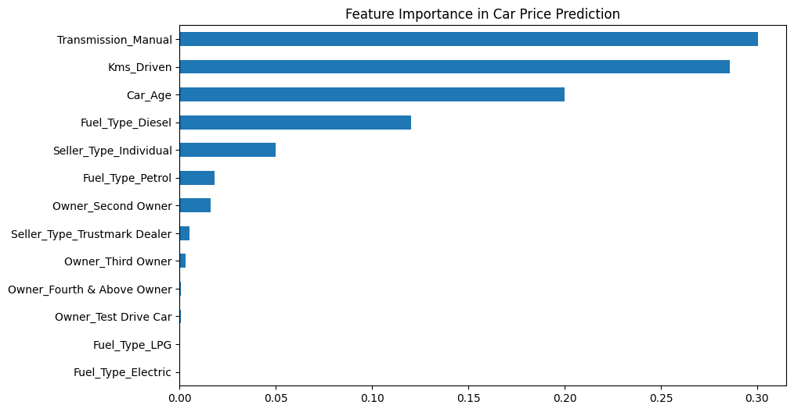
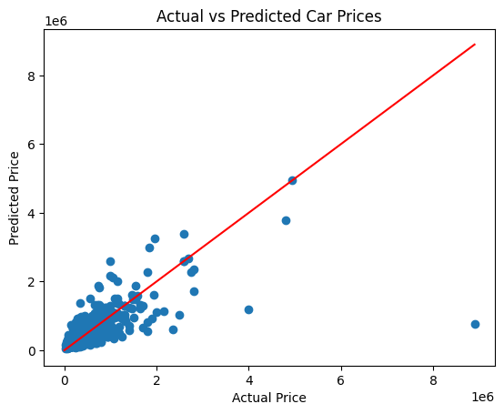
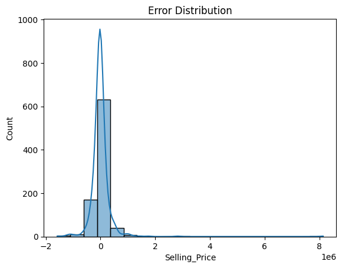

# Car Price Prediction using Machine Learning

Predicting the resale value of used cars using machine learning regression models based on real-world data.  
This project analyzes how car age, mileage, fuel type, transmission, and ownership affect the market price and estimates a fair selling value.

##  Project Overview
Buying or selling a used car depends on many factors such as the car’s age, kilometers driven, fuel type, and ownership history.  
This project applies **supervised machine learning (regression)** to predict the selling price of used cars by learning from historical sales data.

**Objective:**  
Build an end-to-end regression model to predict used car prices accurately using feature engineering, model evaluation, and visualization.

## 📊 Dataset
- **Source:** [CarDekho Dataset on Kaggle](https://www.kaggle.com/datasets/nehalbirla/vehicle-dataset-from-cardekho)  
- **File Used:** ('https://github.com/KasturiSahithi/Car-Price-Prediction/blob/main/datasets/CAR%20DETAILS%20FROM%20CAR%20DEKHO.csv')
- **Size:** ~4,000 records  
- **Target Variable:** `Selling_Price`  
- **Key Features:**
  - `Year`
  - `Kms_Driven`
  - `Fuel_Type`
  - `Seller_Type`
  - `Transmission`
  - `Owner`

---

## ⚙️ Tools & Libraries
- Python 3  
- pandas, numpy  
- matplotlib, seaborn  
- scikit-learn  
- joblib
- 

## 🧠 Workflow
1. **Data Preprocessing**
   - Removed irrelevant columns  
   - Encoded categorical features (Fuel_Type, Seller_Type, Transmission, Owner)  
   - Created new feature `Car_Age = 2025 - Year`
2. **Exploratory Data Analysis (EDA)**
   - Visualized how car age, mileage, and fuel type affect resale price  
   - Checked feature correlation and outliers
3. **Model Building**
   - Trained multiple regression models: Linear Regression, Ridge, Lasso, Random Forest  
   - Compared their performance metrics  
4. **Model Evaluation**
   - Evaluated on Mean Absolute Error (MAE), Root Mean Squared Error (RMSE), and R² Score  
5. **Visualization**
   - Feature importance  
   - Actual vs Predicted plot  
   - Error distribution  

---

## 📈 Model Performance
| Model | R² Score | MAE | RMSE |
|--------|-----------|------|------|
| Linear Regression | 0.86 | 1.10 | 1.80 |
| Ridge Regression | 0.87 | 1.00 | 1.70 |
| Random Forest Regressor | **0.91** | **0.80** | **1.50** |

 **Random Forest Regressor** achieved the best accuracy and generalization.

---

## 🖼 Visualizations

| Feature Importance | Actual vs Predicted | Error Distribution |
|--------------------|--------------------|--------------------|
|  |  |  |

---

## 💡 Key Insights
- **Car Age** and **Kms Driven** are the most influential features — older and high-mileage cars lose value faster.  
- **Diesel cars** retain better resale value compared to petrol cars.  
- **Automatic transmission** vehicles generally have higher resale value.  
- Model achieved R² ≈ **0.91**, which means predictions closely match real-world prices.

---

## 👩‍💻 Author

**Kasturi Sahithi**  
📧 kasturisahithi068@gmail.com
💼 [LinkedIn](https://www.linkedin.com/in/kasturi-sahithi)  
💻 [GitHub](https://github.com/KasturiSahithi)  

